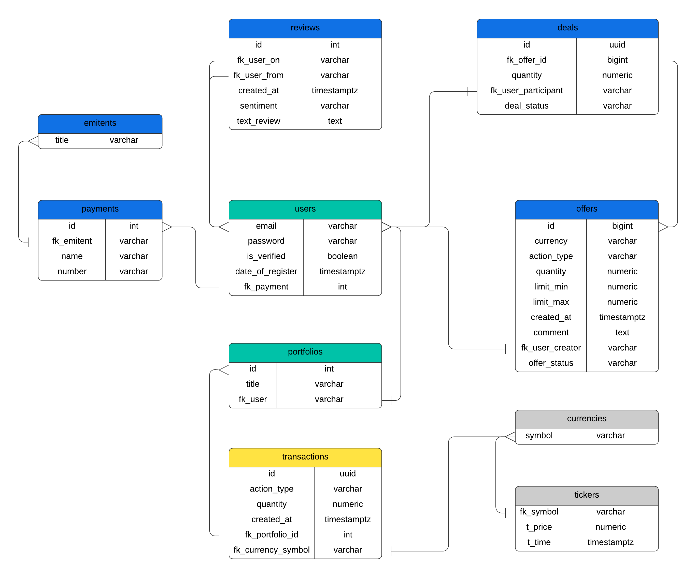

# Документация к базе данных Datafarm

Datafarm - многопользовательская платформа. Пользователи могут создавать свои портфели, откуда доступна статистика по транзакциям. В транзакциях, помимо основной информации об операции, указан портфель, в рамках которого была совершена транзакция, и торговый бот, совершивший эту транзакцию. 

 

### Схема PROFILE

Схема содержит пользовательские данные.

#### Домены

|Title|Type|Length|Description|
|---|---|---|---|
|valid_email|varchar|128|Валидация email|

#### Таблица USERS

Таблица пользователей хранит авторизационные данные. Связана с таблицей `portfolios` (пользователь может иметь несколько портфелей).

|FK|PK|Column|Type|Length|Unique|Nullable|Description|
|---|---|---|---|---|---|---|---|
||*|email|valid_email||*|*|Адрес электронной почты пользователя|
|||password|varchar|100||*|Зашифрованный пароль пользователя|

#### Таблица PORTFOLIOS

Таблица портфелей пользователей хранит данные о параметрах создаваемых пользователями портфелей. Связана с таблицей `transactions` (несколько транзакций могут быть в рамках одного портфеля).

|FK|PK|Column|Type|Length|Unique|Nullable|Description|
|---|---|---|---|---|---|---|---|
||*|id|int||*|*|Идентификатор записи|
|||title|varchar|128|*|*|Название портфеля|
|users(email)||fk_user_email|valid_email|||*|Идентификатор пользователя, кому принадлежит портфель|

### Схема MARKET

Схема является хранилищем рыночных данных, с которыми работает торговая часть платформы. 

#### Таблица CURRENCIES

Хранит список криптовалютных тикеров.

|FK|PK|Column|Type|Length|Unique|Nullable|Description|
|---|---|---|---|---|---|---|---|
||*|symbol|varchar|20|*|*|Тикер криптовалюты|

#### Таблица TICKERS

Таблица представляет собой хранилице исторических данных о ценовых изменениях криптовалют. Данные загружаются в реальном времени через API биржи.

|FK|PK|Column|Type|Length|Unique|Nullable|Description|
|---|---|---|---|---|---|---|---|
|currencies(symbol)||fk_symbol|varchar|20||*|Название тикера|
|||t_price|numeric|||*|Цена тикера|
|||t_time|timestamp|||*|Время тикера|

### Схема TRADING

Схема содержит таблицы, в которых содержится вся основная информация платформы: торговые боты, транзакции.

#### Таблица BOTS

Таблица торговых ботов платформы. Хранит список, в котором каждая запись представляет торгового бота со своими параметрами. Необходимые для работы параметры указаны в колонке `params`. Структура параметров может отличаться для каждого бота.

|FK|PK|Column|Type|Length|Unique|Nullable|Description|
|---|---|---|---|---|---|---|---|
||*|title|varchar|100|*|*|Название торгового бота|
|||description|text||||Описание торгового бота|
|||is_active|boolean|||*|Состояние активности торгового бота, по-умолчанию FALSE|
|||params|jsonb|||*|Параметры со значениями, необходимыми для работы торгового бота|

#### Таблица TRANSACTIONS

Таблица транзакций, совершаемых пользователями в рамках своих портфелей. Содержит внешние ключи, связывающие `transactions` с таблицами `portfolios`, `currencies` и `bots`. Является ключевой таблицей проекта, так как содержит данные, по которым расчитываются балансы портфелей.

|FK|PK|Column|Type|Length|Unique|Nullable|Description|
|---|---|---|---|---|---|---|---|
||*|id|uuid||*|*|Идентификатор записи|
|||action_type|varchar|4||*|Тип транзакции, по-умолчанию BUY|
|||quantity|numeric|||*|Количество криптовалюты в транзакции|
|||created_at|timestamp|||*|Время создания транзакции, по-умолчанию текущее время|
|portfolios(id)||fk_portfolio_id|int|||*|Идентификатор портфеля, в рамках которого происходит транзакция|
|currencies(symbol)||fk_currency_symbol|int|||*|Идентификатор криптовалюты, с которой происходит транзакция|
|bots(title)||fk_bot_title|varchar|||*|Идентификатор криптовалюты, с которой происходит транзакция|